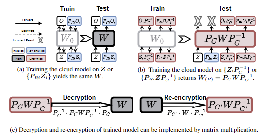

# Permutation Equivariance of Transformers and Its Applications

Official Code for CVPR 2024 paper: Permutation Equivariance of Transformers and Its Applications.




## Introduction

This repository contains the official code for the paper "Permutation Equivariance of Transformers and Its Applications" (CVPR 2024). We provide the code for validation experiments for the properties in the paper, as well as the code for privacy-preserving split learning scenarios.

## Environments

For basic validation experiments, we use the following environment:
- torch, torchvision
- timm
- einops
- transformers, datasets


For attack experiments, we use *PyTorch Lightning* for training.

## How to Run

### Intriguing Properties of Permutation Equivariance

If you are interested in the properties mentioned in the paper, please refer to the `ShowCase` folder. There is simple code for validating the properties with ViT, BERT and GPT.

In `ShowCase/ViT`, you can 'encrypt' a pre-trained ViT-Base model with matrix multiplication permutation. 

```
python encrypt_ViT.py
```
You can also modify the code to load your own model and encrypt it.

You can train your model with/without row/column permutation to validate the properties. 

```
python train_cifar10.py
```

Here are some key arguments for the training code:

- `--r` Use row permutation 
- `--c` Use column permutation
- `--c_idx=5` We provide 9 different permutation patterns for column permutation. You can choose among 1-9. 0 is identity permutation. All the patterns are randomly generated and fixed for reproducibility, so it is not recommended to run `generate_key.py` again.
- `--use_encrypted` Use the encrypted model mentioned above for training.
- `--pretrained` Use the timm pre-trained model for training.

Generally, you can expect the following results: row permutation will not affect the performance of the model, while column permutation works as encryption.


### Privacy-Preserving Split Learning

If you are interested in the privacy-preserving split learning, you need to train your victim model first and check out the performance degradation of different privacy-preserving transformations. 

```
python transfer_learning.py
```

Here is some key arguments for the transfer learning code:

- `--transform=None` choose among `gdp`, `blur`, `gaussian`, `low_pass` and `cutmix`. These are the base privacy-preserving transformations mentioned in the paper

- `--transform-value=0` the hyperparameter for the transformation. Please refer to the paper for the details.

- `--R` Use row permutation to enhance the privacy-preserving effect in a lossless manner.

Check out the `transfer_learning.py` for more details about basic training hyperparameters.

And then, you can train the attacker model in the `BlackBox` folder. 

```
python main.py
```

The same three arguments mentioned above should be aligned with the victim model training.

### Model Encryption

This can be done with the show-case code. Just try to train an encrypted model with/without the column permutation. 

